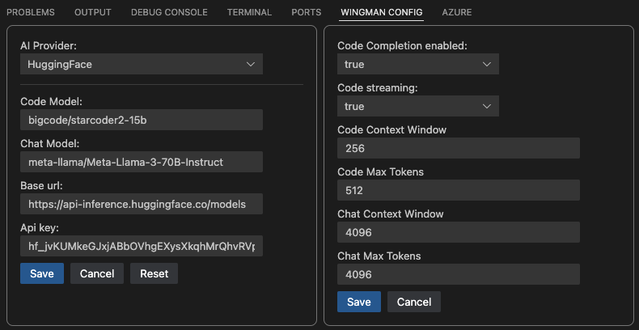

# Wingman - AI Coding Assistant

    

The [Wingman-AI](https://marketplace.visualstudio.com/items?itemName=WingMan.wing-man) extension brings high quality AI assisted coding right to your computer, it's 100% free and private which means data never leaves your machine!

# 🚀 Getting Started

## Choosing an AI Provider

We recommend starting with [Ollama](https://ollama.ai/) using the **Deepseek** model(s), [see why here](https://huggingface.co/spaces/mike-ravkine/can-ai-code-results) or [here](https://evalplus.github.io/leaderboard.html).

-   Install this extension from the VS Code Marketplace: [Wingman-AI](https://marketplace.visualstudio.com/items?itemName=WingMan.wing-man)
-   Install [Ollama](https://ollama.ai/)
-   Install the [supported local models](#supported-models) by running the following command(s):
    **Example**:
    -   _ollama pull deepseek-coder:6.7b-base-q8_0_
    -   _ollama pull deepseek-coder:6.7b-instruct-q8_0_

That's it! This extension will validate that the models are configured correctly in it's VSCode settings upon launch. If you wish to customize which models run see the [FAQ section](#faq).

# Features

## Code Completion

The AI will look for natural pauses in typing to decide when to offer code suggestions (keep in mind the speed is limited by your machine). The code completion feature will also analyze comments you type and generate suggestions based on that context.

### Code Completion Disable / HotKey

We understand that sometimes the code completion feature can be too aggressive, which may strain your system's resources during local development. To address this, we have introduced an option to disable automatic code completion. However, we also recognize the usefulness of on-demand completion. Therefore, we've implemented a hotkey that allows you to manually trigger code completion at your convenience.

When you need assistance, simply press `Shift + Ctrl + Space`. This will bring up a code completion preview right in the editor and a quick action will appear. If you're satisfied with the suggested code, you can accept it by pressing `Enter`. This provides you with the flexibility to use code completion only when you want it, without the overhead of automatic triggers.

## Interactive Chat

Talk to the AI naturally! It will use open files as context to answer your question, or simply select a section of code to use as context. Chat will also analyze comments you type and ge

# AI Providers

## Ollama

[Ollama](https://ollama.ai/) is a free and open-source AI model provider, allowing users to run their own local models.

### Why Ollama?

[Ollama](https://ollama.ai/) was chosen for it's simplicity, allowing users to pull a number of models in different configurations and update them at will. Ollama will pull optimized models based on your system architecture, however if you do not have a GPU accelerated machine, models will be slower.

### Setting up Ollama

Follow the directions on the [Ollama](https://ollama.ai/) website. Ollama has a number of open source models available that are capable of writing high quality code. See [getting started](#🚀-getting-started) for how to pull and customize models.

### Supported Models

The extension uses a separate model for chat and code completion. This is due to the fact that different types of models have different strengths, mixing and matching offers the best result.

**NOTE - You can use any quantization for a supported model, you are not limited.**

**Example: deepseek-coder:6.7b-instruct-q4_0**

Supported Models for _Code Completion_:

-   Deepseek Coder v2-base _(tested with: [deepseek-coder-v2:16b-lite-base-q4_0](https://ollama.com/library/deepseek-coder-v2:16b-lite-base-q4_0))_
-   Deepseek-base _(tested with: [deepseek-coder:6.7b-base-q8_0](https://ollama.ai/library/deepseek-coder:6.7b-base-q8_0))_
-   Codellama-code _(tested with: [codellama:7b-code-q4_K_M](https://ollama.ai/library/codellama:7b-code-q4_K_M))_
-   Magicoder-DS _(tested with [wojtek/magicoder:6.7b-s-ds-q8_0](https://ollama.com/wojtek/magicoder:6.7b-s-ds-q8_0))_
-   CodeQwen1.5 _(tested with [codeqwen:7b-code-v1.5-q5_1](https://ollama.com/library/codeqwen:7b-code-v1.5-q5_1))_
-   Codestral _(tested with [codestral:22b-v0.1-q5_K_M](https://ollama.com/library/codestral:22b-v0.1-q5_K_M))_

Supported Models for _Chat_:

-   Deepseek Coder v2-instruct _(tested with: [deepseek-coder-v2:16b-lite-instruct-q4_0](https://ollama.com/library/deepseek-coder-v2:16b-lite-instruct-q4_0))_
-   Deepseek-Instruct _(tested with: [deepseek-coder:6.7b-instruct-q8_0](https://ollama.ai/library/deepseek-coder:6.7b-instruct-q8_0))_
-   Codellama-Instruct _(tested with: [codellama:7b-instruct](https://ollama.ai/library/codellama:7b-instruct))_
-   Phind-CodeLlama - _(tested with: [phind-codellama:34b-v2-q2_K](https://ollama.ai/library/phind-codellama:34b-v2-q2_K))_
-   Magicoder-DS _(tested with [wojtek/magicoder:6.7b-s-ds-q8_0](https://ollama.com/wojtek/magicoder:6.7b-s-ds-q8_0))_
-   Llama3-Instruct _(tested with [llama3:8b-instruct-q6_K](https://ollama.com/library/llama3:8b-instruct-q6_K))_
-   CodeQwen1.5-Code _(tested with [codeqwen:7b-chat-v1.5-q8_0](https://ollama.com/library/codeqwen:7b-code-v1.5-q8_0))_
-   Codestral _(tested with [codestral:22b-v0.1-q5_K_M](https://ollama.com/library/codestral:22b-v0.1-q5_K_M))_

---

## Hugging Face

[Hugging Face](https://huggingface.co/) supports hosting and training models, but also supports running many models _(under 10GB)_ for free! All you have to do is [create a free account](https://huggingface.co/docs/api-inference/quicktour).

#### Setting up Hugging Face

Once you have a Hugging Face account and an API key, all you need to do is open the VSCode settings pane for this extension "Wingman" (see [FAQ](#faq)).

Once it's open, select "HuggingFace" as the AI Provider and add your API key under the HuggingFace section:

    

### Supported Models

The extension uses a separate model for chat and code completion. This is due to the fact that different types of models have different strengths, mixing and matching offers the best result.

Supported Models for _Code Completion_:

-   CodeLlama _(tested with: [codellama/CodeLlama-7b-hf](https://huggingface.co/codellama/CodeLlama-7b-hf))_
-   Starcoder2 _(tested with [bigcode/starcoder2-15b](https://huggingface.co/bigcode/starcoder2-15b))_

Supported Models for _Chat_:

-   Mixtral v0.1 _(tested with [mistralai/Mixtral-8x7B-Instruct-v0.1](https://huggingface.co/mistralai/Mixtral-8x7B-Instruct-v0.1))_
-   Mistral v0.2 _(tested with: [mistralai/Mistral-7B-Instruct-v0.2](https://huggingface.co/mistralai/Mistral-7B-Instruct-v0.2))_

**NOTE** - Unlike using Ollama, your data is not private and will not be sanitized prior to being sent.

---

## OpenAI

[OpenAI](https://platform.openai.com/docs/models/continuous-model-upgrades) is supported! You can use the following models:

-   GPT4-o
-   GPT4-Turbo
-   GPT4

**NOTE** - Unlike using Ollama, your data is not private and will not be sanitized prior to being sent.

---

## Anthropic

[Anthropic](https://docs.anthropic.com/en/docs/welcome) is supported! You can use the following models:

-   Claude 3.5 Sonnet
-   Claude 3 Opus
-   Claude 3 Haiku

**NOTE** - Unlike using Ollama, your data is not private and will not be sanitized prior to being sent.

---

## FAQ

-   _How can I change which models are being used?_ This extension uses settings like any other VSCode extension, see the examples below.

    

-   _The AI models feel slow, why?_ As of _pre-release 0.0.6_ we've added an indicator in the bottom status bar to show you when an AI model is actively processing. If you aren't using GPU accelerated hardware, you may need to look into [Quantization](https://huggingface.co/docs/optimum/concept_guides/quantization)].

    

-   _Why do some models have "q2" or "q4" after the name?_ [Information on model Quantization](https://huggingface.co/docs/optimum/concept_guides/quantization)

## Troubleshooting

This extension leverages Ollama due to it's simplicity and ability to deliver the right container optimized for your running environment.
However good AI performance relies on your machine specs, so if you do not have the ability to GPU accelerate, responses may be slow.
During startup the extension will verify the models you have configured in the VSCode settings pane for this extension, the extension does have some defaults:

**Code Model** - deepseek-coder:6.7b-base-q8_0

**Chat Model** - deepseek-coder:6.7b-instruct-q8_0

The models above will require enough RAM to run them correctly, you should have at least 12GB of ram on your machine if you are running these models. If you don't have enough ram, then choose a smaller model but be aware that it won't perform as well. Also see [information on model Quantization](https://huggingface.co/docs/optimum/concept_guides/quantization).

## Release Notes

To see the latest release notes - [check out our releases page](https://github.com/RussellCanfield/wingman-ai/releases).

---

If you like the extension, please leave a review! If you don't, open an issue and we'd be happy to assist!

**Enjoy!**
