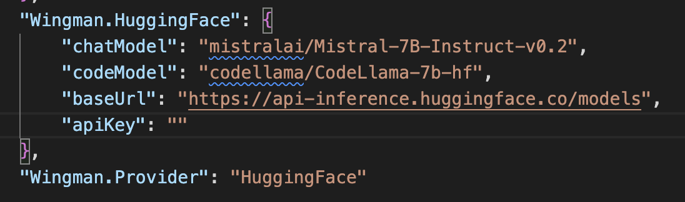
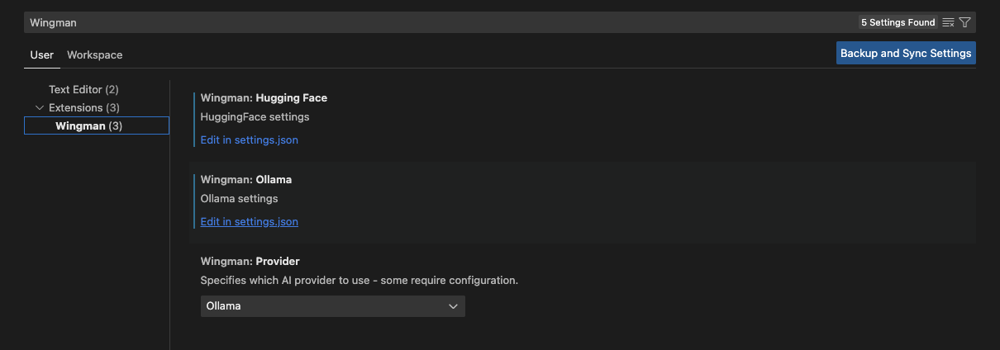
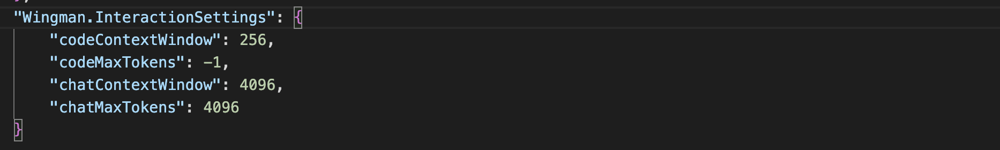
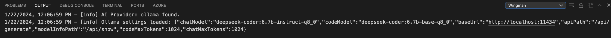

# Wingman - AI Coding Assistant

<p align="center" width="100%">
    
</p>

The [Wingman-AI](https://marketplace.visualstudio.com/items?itemName=WingMan.wing-man) extension brings high quality AI assisted coding right to your computer, it's 100% free and data never leaves your machine - meaning it's completely private! Since the current release of this extension relies on running the AI models locally using [Ollama](https://ollama.ai/), it is recommended you are on a machine with capable graphics card (Apple M series/Nvidia cards) for the best performance.

## 🚀 Getting Started

We recommend starting with Ollama with a deepseek model(s), [see why here](https://huggingface.co/spaces/mike-ravkine/can-ai-code-results).

-   Install this extension from the VS Code Marketplace: [Wingman-AI](https://marketplace.visualstudio.com/items?itemName=WingMan.wing-man)
-   Install [Ollama](https://ollama.ai/)
-   Install the supported local models by running the following command(s):
    **Example**:
    -   _ollama pull deepseek-coder:6.7b-base-q8_0_
    -   _ollama pull deepseek-coder:6.7b-instruct-q8_0_
-   That's it! This extension will validate that the models are configured correctly in it's VSCode settings upon launch. If you wish to customize which models run see the [FAQ section](#faq).

## Features

### Code Completion

The AI will look for natural pauses in typing to decide when to offer code suggestions (keep in mind the AI is limited by your machine speed).

[](https://www.youtube.com/watch?v=panJL4DUGkA)

### Interactive Chat

Talk to the AI naturally! It will use open files as context to answer your question, or simply select a section of code to use as context.

[](https://www.youtube.com/watch?v=1W3h2mOdjmc)

[](https://www.youtube.com/watch?v=2sJZpyYi3Fc)

## AI Providers

### Ollama

[Ollama](https://ollama.ai/) is a free and open-source AI model provider, allowing users to run their own local models.

#### Why Ollama?

[Ollama](https://ollama.ai/) was chosen for it's simplicity, allowing users to pull a number of models in different configurations and update them at will. Ollama will pull optimized models based on your system architecture, however if you do not have a GPU accelerated machine, models will be slower.

#### Setting up Ollama

Follow the directions on the [Ollama](https://ollama.ai/) website. Ollama has a number of open source models available that are capable of writing high quality code. See [getting started](#🚀-getting-started) for how to pull and customize models.

#### Supported Models

The extension uses a separate model for chat and code completion. This is due to the fact that different types of models have different strengths, mixing and matching offers the best result.

Supported Models for _Code Completion_:

-   Deepseek-base _(tested with: [deepseek-coder:6.7b-base-q8_0](https://ollama.ai/library/deepseek-coder:6.7b-base-q8_0))_
-   Codellama-code _(tested with: [codellama:7b-code-q4_K_M](https://ollama.ai/library/codellama:7b-code-q4_K_M))_

Supported Models for _Chat_:

-   Deepseek-Instruct _(tested with: [deepseek-coder:6.7b-instruct-q8_0](https://ollama.ai/library/deepseek-coder:6.7b-instruct-q8_0))_
-   Codellama-Instruct _(tested with: [codellama:7b-instruct](https://ollama.ai/library/codellama:7b-instruct))_
-   Phind-CodeLlama - _(tested with: [phind-codellama:34b-v2-q2_K](https://ollama.ai/library/phind-codellama:34b-v2-q2_K))_

---

### Hugging Face

[Hugging Face](https://huggingface.co/) supports hosting and training models, but also supports running many models _(under 10GB)_ for free! All you have to do is [create a free account](https://huggingface.co/docs/api-inference/quicktour). **_This does mean that data leaves your machine!_** But this is an excellent option if you don't have the compute locally to run Ollama.

#### Setting up Hugging Face

Once you have a Hugging Face account and an API key, all you need to do is open the VSCode settings pane for this extension "Wingman" (see [FAQ](#faq)).

Once it's open, select "HuggingFace" as the AI Provider and add your API key under the HuggingFace section:

<p align="center" width="100%">
    
</p>

#### Supported Models

The extension uses a separate model for chat and code completion. This is due to the fact that different types of models have different strengths, mixing and matching offers the best result.

Supported Models for _Code Completion_:

-   CodeLlama _(tested with: [codellama/CodeLlama-7b-hf](https://huggingface.co/codellama/CodeLlama-7b-hf))_

Supported Models for _Chat_:

-   Mixtral v0.1 _(tested with [mistralai/Mixtral-8x7B-Instruct-v0.1](https://huggingface.co/mistralai/Mixtral-8x7B-Instruct-v0.1))_
-   Mistral v0.2 _(tested with: [mistralai/Mistral-7B-Instruct-v0.2](https://huggingface.co/mistralai/Mistral-7B-Instruct-v0.2))_

## FAQ

-   _How can I change which models are being used?_ This extension uses settings like any other VSCode extension, see the examples below. **NOTE Changing a model reloads reloading VSCode (on mac cmd+R).**

<p align="center" width="100%">
    
</p>

<p align="center" width="100%">
    
</p>

-   _The AI models feel slow, why?_ As of _pre-release 0.0.6_ we've added an indicator in the bottom status bar to show you when an AI model is actively processing. If you aren't using GPU accelerated hardware, you may need to look into [Quantization](https://huggingface.co/docs/optimum/concept_guides/quantization)].

<p align="center" width="100%">
    
</p>

-   _Why do some models have "q2" or "q4" after the name?_ [Information on model Quantization](https://huggingface.co/docs/optimum/concept_guides/quantization)

## Troubleshooting

This extension leverages Ollama due to it's simplicity and ability to deliver the right container optimized for your running environment.
However good AI performance relies on your machine specs, so if you do not have the ability to GPU accelerate, responses may be slow.
During startup the extension will verify the models you have configured in the VSCode settings pane for this extension, the extension does have some defaults:

**Code Model** - deepseek-coder:6.7b-base-q8_0

**Chat Model** - deepseek-coder:6.7b-instruct-q8_0

The models above will require enough RAM to run them correctly, you should have at least 12GB of ram on your machine if you are running these models. If you don't have enough ram, then choose a smaller model but be aware that it won't perform as well. Also see [information on model Quantization](https://huggingface.co/docs/optimum/concept_guides/quantization).

## Release Notes

### 0.2.5

Re-enable Refactor on explicit invoke only.

### 0.2.4

Fix an error message when Ollama was selected as an AI Provider but not available.

### 0.2.3

**Document generation** - Wingman can now generate documents! Use the "Code Actions" menu to access.

**Refactor** - Wingman can attempt to refactor a method or class inline, simplify highlight it and use the "Code Actions" menu.

[More information here](https://code.visualstudio.com/docs/typescript/typescript-refactoring)

**Full Changelog**: https://github.com/RussellCanfield/wingman-ai/compare/v0.2.1...v0.2.2

### 0.2.1

**Wingman Congfig** - small release to add the rest of the config settings to the Config Panel.

### 0.2.0

**Wingman Config** - a new configuration view is available in the editor, allowing you to change settings for better speed/performance without going into VSCode's settings - this is currently limited to Ollama for this release.

**Streaming Code Completion** - as part of the new configuration screen, you can now set code completion to "streaming" which will allow for better code completion without having to wait for the full response to load.

**Chat auto focus** - the chat input for Wingman will now auto focus on load.

### 0.1.9

Chat now has a text area for easier multi-line support! Fixed an issue affecting chat context.

### 0.1.7

**OpenAI support is here!** If you have OpenAI credits or pay for the subscription you can now use it in Wingman. Simply select your 'AI Provider' in the VSCode settings for this extension (Wingman), then add your API key in the OpenAI settings - identical to how HuggingFace works.

With copilot still using GPT-3.5, you now have a faster and more powerful model at your fingertips!

We currently only support GPT-4 but recommend GPT-4 turbo **(ex: "gpt-4-0125-preview")**

### 0.1.6

Remove extraneous stop token from HuggingFace code completion.

### 0.1.5

The HuggingFace chat provider now supports Mixtral! This is a high performing AI that rivals GPT. If you are using our HuggingFace provider, try it out by setting the **"chatModel"** to **"mistralai/Mixtral-8x7B-Instruct-v0.1"**. This is now the default for HuggingFace.

### 0.1.4

Reworked generic LLM settings to a common "Interaction Settings" section.
Included the ability to customize the context token to include performance at the cost of quality.
For code completion this can sacrifice contextual awareness of the LLM for performance. Experiment with what feels good for your machine and code base. Below are the defaults, the previous defaults for context window(s) were **4096**.

<p align="center" width="100%">
    
</p>

We've decided to take a conservative approach with code completion for now, here are the default values:

```json
{
	"codeContextWindow": 256,
	"codeMaxTokens": -1,
	"chatContextWindow": 4096,
	"chatMaxTokens": 4096
}
```

### 0.1.3

Added logging output for the extension for troubleshooting purposes. Improved error handling and user feedback for invalidated configurations.

<p align="center" width="100%">
    
</p>

### 0.1.2

-   Add two new settings:
    -   **codeMaxTokens** - the maximum number tokens to generate in a single request (default: 1024)
    -   **chatMaxTokens** - the maximum number tokens to generate in a single request (default: 1024)

These settings will help you tune how long the AI takes to generate a response, the lower the number the shorter it takes, the higher the longer it takes.
However, if you set these too low you'll get very short responses and it may not provide the functionality you are looking for.

### 0.1.1

-   Fix a bug with the current line terminating too early in code completion.
-   Default to a stronger model for code completion (now - deepseek-coder:6.7b-base-q8_0).

### 0.1.0

Initial release of Wingman-AI! This includes:

-   Ollama Phind-Codellama chat model support.
-   Hugging Face support.
-   Expanded context for chat and code completion.

### 0.0.5

Initial pre-release of Wingman-AI!

---

**Enjoy!**
