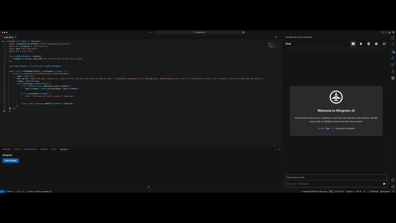
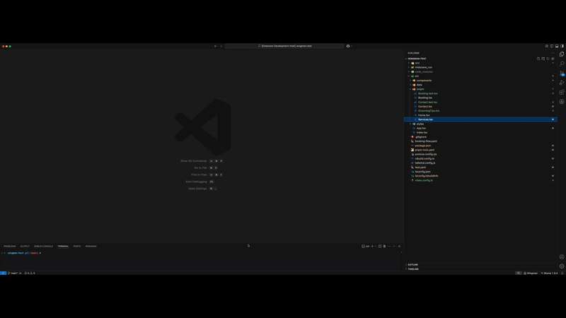
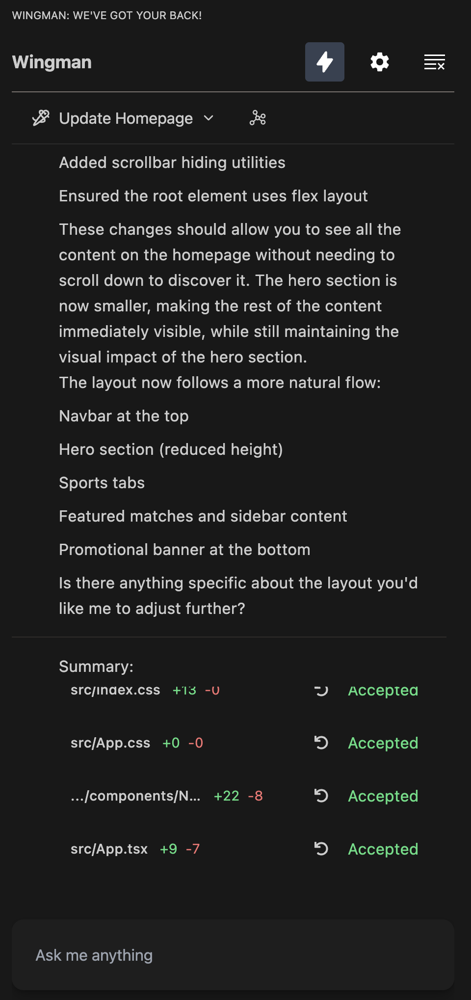
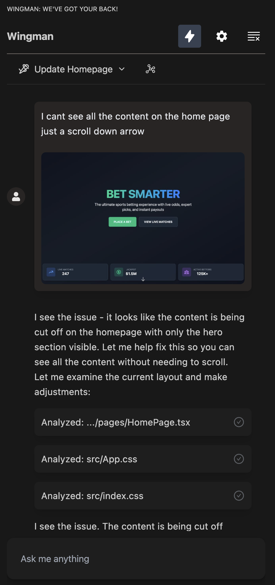
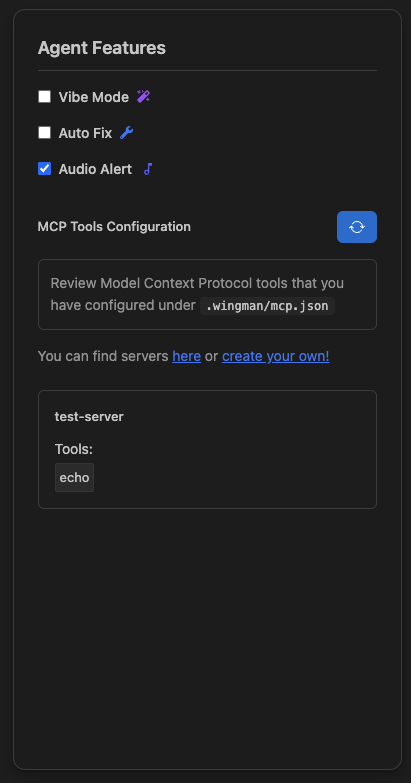
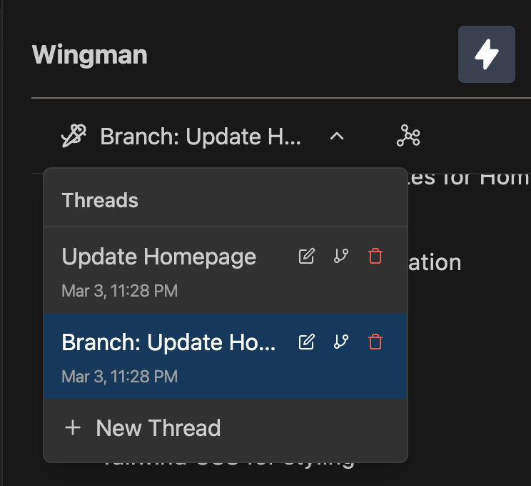
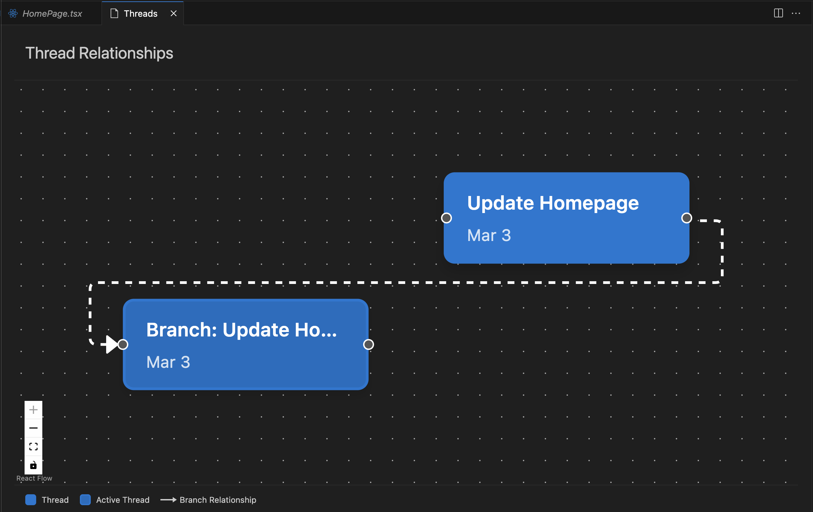

    

<h2 align="center">Wingman AI Coding Assistant</h2>

<b>

[Wingman-AI](https://marketplace.visualstudio.com/items?itemName=WingMan.wing-man) brings high quality AI agentic coding right to your computer. We support most major AI providers - OpenAI, Anthropic and Ollama which is 100% free and private.

Wingman is also supports [Model Context Protocol](https://modelcontextprotocol.io/introduction) tools, allowing you to extend and integrate with a number of servers already available such as Figma or even [your own browser](https://github.com/AgentDeskAI/browser-tools-mcp)!

Have a specific question? Simply highlight text in the editor and Wingman will focus there. Want Wingman to work on it's own? Give it requirements and even attach an image and let it implement complete features for you - even executing commands.

</b>

  

  

<h2 align="center">Documentation</h2>

<b> Want a new feature? Need to report an issue? [visit our GitHub](https://github.com/RussellCanfield/wingman-ai).

<h2 align="center">Features</h2>

<b> [Wingman-AI](https://marketplace.visualstudio.com/items?itemName=WingMan.wing-man) supports advanced features such as: </b>

<h3>Code completion</h3>
Real-time code suggestions as you type
<h3>Chat</h3>
Agent based chat and complete code writing experience
<h3>MCP Integration</h3>
Integrate with MCP tools directly in Wingman, giving you the ability to extend its capabilities
<h3>Threads</h3>
Start a session, create new ones and even branch off an existing - allowing you to organize flows
<h3>Document Generation</h3>
Generate documentation for code with one click
<h3>Refactor</h3>
Refactor code quickly with one click

 
 

  

  

  

  

  

## Release Notes

To see the latest release notes - [check out our releases page](https://github.com/RussellCanfield/wingman-ai/releases).

---

If you like the extension, please leave a review! If you don't, open an issue and we'd be happy to assist!

**Enjoy!**
