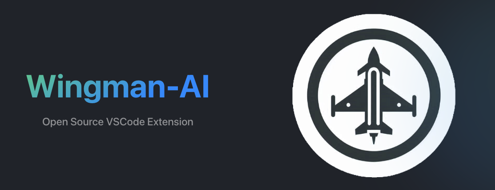

<p align="center" width="100%">
  
</p>

# Wingman AI Agent System

Wingman is a **stateful, multi-agent runtime** with a **local CLI control plane** and a **gateway** for routing, sessions, and collaboration. It is designed for more than coding: use it for research, operations, support, planning, and any workflow where agents, tools, and durable context matter.

## What Wingman Is

- **Gateway-first runtime**: The gateway hosts agents, routing, and durable sessions by default.
- **Local control plane**: The CLI configures, invokes, and connects to the gateway, with an optional `--local` execution mode.
- **Multi-agent orchestration**: A root agent can delegate to specialized subagents with clear roles.
- **Protocol-first**: The gateway streams raw agent events so any client (web, mobile, terminal) can render them.
- **Tool-driven UI prompts (SGUI)**: tool calls can include UI render hints for Web UI components.
- **Extensible**: Custom agents, hooks, skills, and MCP tools let you tailor workflows to your team.

## What It’s For (Not Just Coding)

Wingman is an agent system, not a single “coding assistant.” Example use cases:

- **Engineering**: design reviews, refactors, dependency audits, multi-file changes, test automation
- **Research**: technology evaluations, competitive analysis, documentation synthesis
- **Operations**: scheduled routines, webhook-driven triage, incident summaries
- **Support**: channel routing, account-specific agents, structured responses
- **Custom domains**: finance, legal, data pipelines, or any workflow with tool integrations

## Architecture at a Glance

- **Wingman Gateway**: stateful runtime for agents, routing, sessions, and channels
- **Wingman CLI**: local control plane for onboarding, config, and agent invocation
- **Control UI**: chat + streaming interface (served by the gateway)
- **Wingman macOS App (planned)**: menu-bar companion that exposes macOS-only capabilities as a node

By default, the CLI connects to a local gateway. For isolated, local-only runs, use `--local`.

## Documentation Gate (Source of Truth)

**All product requirements live in `docs/requirements/`.** These PRDs are the source of truth and act as a documentation gate:

- Any product or behavior change must update the relevant PRD(s).
- PRs are expected to keep requirements and implementation in sync.
- Legacy docs outside `docs/requirements/` (including any historical docs-site content) should not be used for product decisions.

Key docs:
- `docs/requirements/000-architecture-overview.md`
- `docs/requirements/001-multi-agent-architecture.md`
- `docs/requirements/002-gateway-prd.md`
- `docs/requirements/003-macos-app-prd.md`
- `docs/requirements/004-node-protocol.md`
- `docs/requirements/005-web-ui-sgui-prd.md`
- `docs/custom-agents.md`

## Quick Start

### Install

```bash
npm install -g @wingman-ai/gateway
```

### Initialize a Workspace

```bash
wingman init
```

### Start the Gateway

```bash
wingman gateway start
```

### Gateway Auth (Environment Token)

```bash
export WINGMAN_GATEWAY_TOKEN=sk-...
wingman gateway start --auth
```

### Connect

- **CLI**: `wingman chat`
- **Control UI**: `http://localhost:18790` (default)
- **VS Code**: Install the Wingman extension (see project repo)

### Provider Auth

```bash
# Cloud providers
wingman provider login anthropic
wingman provider login openai
wingman provider login openrouter
wingman provider login xai
wingman provider login copilot

# Local providers (optional - work without auth)
wingman provider login lmstudio  # Optional
wingman provider login ollama     # Optional
```

### Local-only (No Gateway)

```bash
wingman agent --local --agent <id> "prompt"
```

## Gateway Configuration (All the Ways + Why)

Gateway behavior can be configured in three layers (higher priority wins): runtime flags, environment variables, and `wingman.config.json`. Use the config file for persistent defaults, then override per run when needed.

### 1) `wingman.config.json` (persistent defaults)

- `gateway.host` / `gateway.port` - bind address + port. Use `0.0.0.0` for LAN access, or change the port to avoid conflicts.
- `gateway.stateDir` - where durable sessions and gateway state live. Point to fast local storage or a shared volume.
- `gateway.fsRoots` - allowlist for Control UI working folders and output paths. Keep this tight for safety.
- `gateway.auth.mode` / `gateway.auth.token` / `gateway.auth.password` - gateway auth strategy (token, password, or none) for remote access.
- `gateway.auth.allowTailscale` - trust Tailscale identity headers so Tailnet users can access without tokens.
- `gateway.controlUi.enabled` / `gateway.controlUi.port` - enable/disable Control UI and choose its port.
- `gateway.controlUi.pairingRequired` - require pairing for Control UI clients (recommended).
- `gateway.controlUi.allowInsecureAuth` - only for local dev when testing auth flows.
- `gateway.adapters.discord.*` - Discord output adapter:
  - `enabled`, `token`, `mentionOnly`, `allowBots`, `allowedGuilds`, `allowedChannels`
  - `channelSessions` to pin channels to a session (or `agent:<id>:` to force routing)
  - `sessionCommand` for ad-hoc session overrides
  - `responseChunkSize` to fit Discord message limits
  - Optional `gatewayUrl`, `gatewayToken`, `gatewayPassword` to point the adapter at a remote gateway

### 2) Runtime flags (`wingman gateway start` / `run`)

- `--host`, `--port` - override bind address + port for this run.
- `--auth`, `--auth-mode`, `--token`, `--password` - enable auth without editing config.
- `--discovery mdns|tailscale`, `--name` - advertise your gateway for LAN or Tailnet discovery.
- `--max-nodes`, `--ping-interval`, `--ping-timeout` - tune scale and heartbeat behavior.
- `--log-level` - dial verbosity for debugging or production.

### 3) Environment overrides

- `WINGMAN_GATEWAY_TOKEN` - supply a token at runtime so you don't store secrets in config.

### Related gateway behavior (configured elsewhere)

- `agents.bindings` - deterministic routing rules used by the gateway to select an agent per inbound channel/message.
- `voice` - gateway TTS defaults (provider + settings), with optional per-agent overrides for voice-enabled UIs.

### Example configs (common setups)

#### 1) Local dev (single user, no auth)

```json
{
  "gateway": {
    "host": "127.0.0.1",
    "port": 18789,
    "auth": { "mode": "none" },
    "controlUi": { "enabled": true, "port": 18790 }
  }
}
```

#### 2) Shared LAN gateway (token auth + restricted outputs)

```json
{
  "gateway": {
    "host": "0.0.0.0",
    "port": 18789,
    "fsRoots": ["~/Projects", "~/.wingman/outputs"],
    "auth": { "mode": "token" },
    "controlUi": { "enabled": true, "port": 18790, "pairingRequired": true }
  }
}
```

Tip: set `WINGMAN_GATEWAY_TOKEN` at runtime so you do not store tokens in config.

#### 3) Headless gateway + Discord output adapter

```json
{
  "gateway": {
    "host": "0.0.0.0",
    "port": 18789,
    "auth": { "mode": "token" },
    "controlUi": { "enabled": false },
    "adapters": {
      "discord": {
        "enabled": true,
        "token": "DISCORD_BOT_TOKEN",
        "mentionOnly": true,
        "allowedGuilds": ["123456789012345678"],
        "allowedChannels": ["987654321098765432"],
        "channelSessions": {
          "987654321098765432": "agent:support:discord:channel:987654321098765432"
        }
      }
    }
  }
}
```

#### 4) Remote access over Tailscale + voice TTS

```json
{
  "gateway": {
    "host": "0.0.0.0",
    "port": 18789,
    "auth": { "mode": "token", "allowTailscale": true },
    "controlUi": { "enabled": true, "port": 18790, "pairingRequired": true }
  },
  "voice": {
    "provider": "elevenlabs",
    "defaultPolicy": "off",
    "elevenlabs": {
      "voiceId": "VOICE_ID",
      "modelId": "eleven_multilingual_v2",
      "stability": 0.4,
      "similarityBoost": 0.7
    }
  }
}
```

Start discovery at runtime:

```bash
wingman gateway start --discovery tailscale --name "Work Gateway"
```

## Core Concepts

- **Deterministic routing**: bindings map inbound messages to a single agent by default.
- **Durable sessions**: sessions live in the gateway and persist across clients/devices.
- **Agent isolation**: each agent has its own workspace, config, and session store.
- **Explicit broadcast**: rooms enable parallel agent responses when requested.

## Capabilities

- **Channels + bindings** for deterministic routing across accounts and peers.
- **Routines** for scheduled runs and repeatable workflows.
- **Webhooks** to trigger agents from external systems.
- **Hooks** for pre/post tool automation.
- **Skills** for reusable, domain-specific instruction sets.
- **MCP tools** to connect external systems and custom integrations.

## Development

### Prerequisites

- Bun (required for `bun:sqlite` support)
- Node.js (for tools outside Bun)

### Install

```bash
bun install
```

### Build

```bash
cd wingman
bun run build
```

### Run Gateway (with Control UI)

```bash
cd wingman
./bin/wingman gateway start
```

### Run Gateway + Web UI (hot reload)

```bash
cd wingman
bun run dev
```

### Tests

```bash
cd wingman
bun run test
```

### Config and Logs

- Config: `wingman/.wingman/wingman.config.json`
- Logs: `~/.wingman/logs/wingman.log`

## Contributing Expectations

- Keep `docs/requirements/` current for any behavior changes.
- Add tests for new functionality.
- Ensure all tests and builds pass before submitting.

## License

See `LICENSE.txt`.
